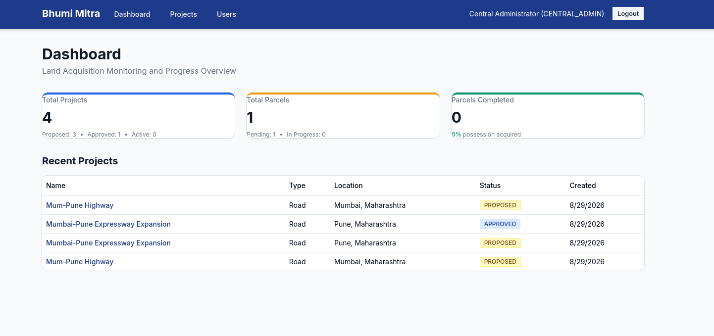
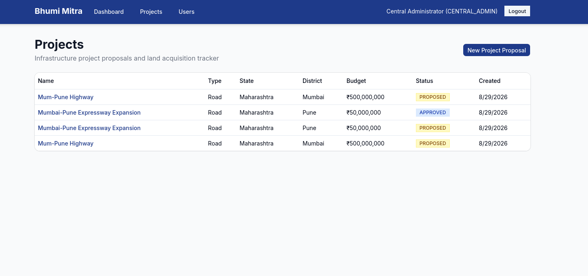
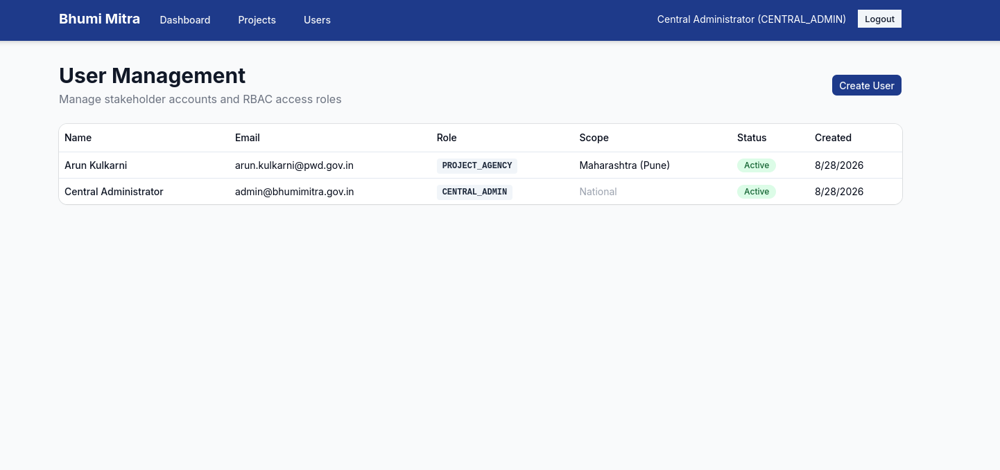
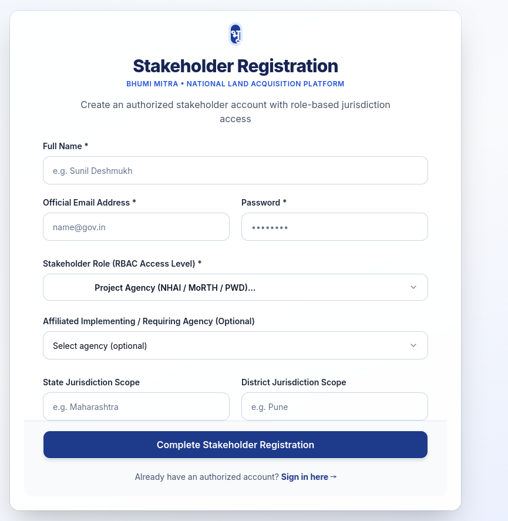

# Bhumi Mitra (भूमि मित्र) — National Land Acquisition & Management Platform

[](https://www.sih.gov.in/)
[](https://fastapi.tiangolo.com)
[-black.svg?logo=next.js)](https://nextjs.org)
[](https://postgis.net)
[](https://maplibre.org)
[](https://min.io)

**Bhumi Mitra** is a national-scale digital platform for end-to-end orchestration, GIS visualization, and role-based tracking of India's infrastructure land acquisition lifecycle — Highways, Railways, Irrigation, Industrial Corridors, Renewable Energy, and Urban Infrastructure.

Designed for **Smart India Hackathon 2026 (SIH26016)** — coordinating Central Ministries, State Governments, District Administrations, and Project Implementing Agencies.

---

## 📸 Platform Screenshots

| **1. Executive Dashboard & Analytics** | **2. Infrastructure Projects Tracker** |
| :---: | :---: |
|  |  |
| *Role-scoped real-time KPI overview, status distributions & recent projects* | *Project proposals with search, state/district allocation & budget tracking* |

| **3. Stakeholder & RBAC User Management** | **4. Role-Based Stakeholder Registration** |
| :---: | :---: |
|  |  |
| *Administrative control panel for role delegations & jurisdictions* | *Onboarding portal with agency affiliation & district/state scopes* |

---

## 🏛️ System Architecture

```
Bhumi_Mitra/
├── backend/                        # FastAPI Python 3.11+ Backend
│   ├── alembic/                    # Database migrations (PostGIS hooks)
│   ├── app/
│   │   ├── core/                   # Config (Pydantic Settings), DB Session, Security (JWT/RBAC)
│   │   ├── modules/
│   │   │   ├── auth/               # User accounts, JWT auth, Agencies, RBAC guards
│   │   │   ├── projects/           # Project proposal lifecycle, GeoJSON boundary
│   │   │   ├── parcels/            # Parcel tracking, ULPIN uniqueness, GIS geometry
│   │   │   ├── workflow/           # 5-stage acquisition workflow & completion engine
│   │   │   ├── documents/          # MinIO S3 object storage & evidence attachment
│   │   │   ├── dashboard/          # Role-scoped summary statistics & audit log
│   │   │   ├── mock_gov_api/       # Mock DILRMP/ULPIN land-record integration
│   │   │   └── gov_api_gateway/    # 🔌 Government API Gateway (placeholder for production)
│   │   └── scripts/
│   │       └── seed.py             # Idempotent seed: admin + government agencies
│   └── tests/                      # Pytest suite
├── frontend/                       # Next.js 14 (App Router) + TypeScript
│   └── src/
│       ├── app/
│       │   ├── login/              # Split-panel authentication portal
│       │   ├── register/           # Stakeholder registration with RBAC selection
│       │   ├── dashboard/          # KPI cards, status distributions, recent projects
│       │   ├── projects/           # Project listing with search & proposal creation
│       │   ├── projects/[id]/      # Project detail, approval actions, parcel map
│       │   ├── parcels/[id]/       # Parcel stage table, event forms & evidence docs
│       │   ├── notifications/      # 🔔 Alerts & notifications (placeholder)
│       │   ├── reports/            # 📊 Reports & analytics (placeholder)
│       │   └── admin/users/        # User management & RBAC configuration
│       ├── components/
│       │   ├── layout/Navbar.tsx   # Responsive navbar with mobile menu
│       │   ├── map/                # MapLibre GIS viewer (ProjectMap, BoundaryDrawer)
│       │   ├── StageStatusList.tsx  # Workflow stage status table
│       │   └── StatusBadge.tsx     # Status indicator badges
│       └── lib/                    # API client, Auth context, TypeScript schemas
├── docker-compose.yml              # Multi-container orchestration
└── .env.example                    # Environment configuration template
```

---

## 🔌 Government API Gateway (Production Integration)

The platform includes a **dedicated Government API Gateway module** (`backend/app/modules/gov_api_gateway/`) designed for seamless integration with government services when API access is granted:

| Integration | Service | Status |
|---|---|---|
| **DILRMP** | Digital India Land Records Modernisation Programme | 🟡 Placeholder — using mock data |
| **Bhu-Naksha** | Cadastral Map Service | 🟡 Placeholder |
| **ULPIN** | Unique Land Parcel Identification Number validation | 🟡 Placeholder — pattern matching |
| **NIC Cloud (MeghRaj)** | Government cloud infrastructure | 🟡 Placeholder |
| **Aadhaar eKYC** | Stakeholder identity verification | 🟡 Placeholder |
| **PFMS** | Public Financial Management System (compensation tracking) | 🟡 Placeholder |
| **SMS Gateway** | NIC/CDAC SMS notification service | 🟡 Placeholder |
| **Email APIs** | NIC email service | 🟡 Placeholder |
| **DigiLocker** | Document verification & storage | 🟡 Placeholder |

> Each integration follows a consistent pattern: check if enabled → if yes, call real API → if no, return mock/placeholder data with a `_source` flag. Enable by configuring API keys in the `.env` file.

---

## 🔒 Role-Based Access Control (RBAC) Matrix

| Action | Allowed Roles |
|---|---|
| **Create Project Proposal** | `PROJECT_AGENCY`, `CENTRAL_ADMIN` |
| **Approve / Reject Project** | `CENTRAL_ADMIN`, `STATE_ADMIN` |
| **Add / Edit Parcel Records** | `DISTRICT_AUTHORITY`, `CENTRAL_ADMIN` |
| **Record Notification Issued** | `DISTRICT_AUTHORITY` |
| **Record Award Declared** | `DISTRICT_AUTHORITY`, `STATE_ADMIN` |
| **Record Compensation Disbursed** | `DISTRICT_AUTHORITY`, `STATE_ADMIN` |
| **Record R&R Milestone** | `DISTRICT_AUTHORITY` |
| **Record Final Possession** | `DISTRICT_AUTHORITY` |
| **Upload Stage / Parcel Documents** | `DISTRICT_AUTHORITY`, `PROJECT_AGENCY`, `FIELD_OFFICER` |
| **View Dashboards (State Scoped)** | `STATE_ADMIN` (own state only) |
| **View Dashboards (District Scoped)** | `DISTRICT_AUTHORITY` (own district only) |
| **View Dashboards (National)** | `CENTRAL_ADMIN`, `AUDITOR` |
| **Manage Stakeholder Accounts** | `CENTRAL_ADMIN` only |
| **Read-Only Inspection** | `VIEWER` |

---

## ⚡ Core Business Rules

### 1. Parcel Completion Condition
A parcel's `overall_status` becomes **`COMPLETED`** if and only if **all** of the following are satisfied:
1. `NOTIFICATION` stage status is `COMPLETED`
2. `AWARD` stage status is `COMPLETED`
3. `COMPENSATION` stage status is `COMPLETED` **AND** compensation `payment_status` is `DISBURSED`
4. `RNR` (Rehabilitation & Resettlement) is `COMPLETED` **OR** `NOT_APPLICABLE`
5. `POSSESSION` stage status is `COMPLETED`

Otherwise, `overall_status` is `IN_PROGRESS` if any stage has moved past `PENDING`, else `PENDING`.

### 2. Stage-Specific Enforcement
- **Strict Ordering:** Stages must be completed in order (`Notification` → `Award` → `Compensation` → `R&R` → `Possession`). Out-of-order attempts return HTTP `409 Conflict` with clear prerequisite error messages.
- **R&R Auto-Resolution:** When a parcel has zero affected families, R&R automatically resolves to `NOT_APPLICABLE`.
- **Compensation Disbursal Gate:** Compensation with status `ASSESSED` or `APPROVED` keeps the stage at `IN_PROGRESS`. Only `DISBURSED` completes the stage.
- **ULPIN Uniqueness:** Duplicate ULPIN registration across any project is rejected with HTTP `409`.
- **Rejected Project Lockout:** Rejected projects reject parcel stage updates with HTTP `409`.

---

## 🚀 Setup & Installation

### Prerequisites
- [Docker](https://docs.docker.com/get-docker/) & [Docker Compose](https://docs.docker.com/compose/install/)
- [Node.js 20+](https://nodejs.org/) and [Python 3.11+](https://www.python.org/) (if running without Docker)
- [Git](https://git-scm.com/)

### Option A: Docker Compose (Recommended)

```bash
# 1. Clone the repository
git clone https://github.com/ANUJ760/Bhumi_Mitra.git
cd Bhumi_Mitra

# 2. Configure environment
cp .env.example .env
# Edit .env and set your own passwords (or use defaults for local dev)

# 3. Start all services
docker compose up --build -d

# 4. Run database migrations & seed admin
docker compose exec backend alembic upgrade head
docker compose exec backend python -m app.scripts.seed
```

> ⚠️ **The seed script generates a random admin password** and prints it to the console. Copy it immediately — it will not be shown again.

```
============================================================
  ADMIN ACCOUNT CREATED
  Email:    admin@bhumimitra.gov.in
  Password: <randomly-generated-password>
  ⚠️  Save this password — it will not be shown again.
============================================================
```

**Access the platform:**
| Service | URL |
|---|---|
| Frontend | [http://localhost:3000](http://localhost:3000) |
| API Docs (Swagger) | [http://localhost:8000/docs](http://localhost:8000/docs) |
| MinIO Console | [http://localhost:9001](http://localhost:9001) |

---

### Option B: Local Development (Manual)

```bash
# 1. Start database & object storage
docker compose up -d postgres minio

# 2. Backend setup
cd backend
python -m venv .venv
source .venv/bin/activate     # On Windows: .venv\Scripts\activate
pip install -r requirements.txt
alembic upgrade head
python -m app.scripts.seed    # ← Save the generated admin password!
uvicorn app.main:app --reload --port 8000

# 3. Frontend setup (new terminal)
cd frontend
npm install
npm run dev
```

Open [http://localhost:3000](http://localhost:3000) in your browser.

---

## 🧪 Testing & Acceptance Walkthrough

Follow this step-by-step verification to test the complete land acquisition lifecycle:

### Step 1: Sign in as Central Admin
- Navigate to `/login`
- Enter email: `admin@bhumimitra.gov.in`
- Enter the password generated during seeding

### Step 2: Create Stakeholder Users
- Go to `/admin/users`, click **Create User**
- Create a `PROJECT_AGENCY` user (e.g., `agency@pwd.gov.in`)
- Create a `STATE_ADMIN` user with State Scope: `Maharashtra`
- Create a `DISTRICT_AUTHORITY` user with State: `Maharashtra`, District: `Pune`

### Step 3: Submit a Project Proposal
- Sign in as the `PROJECT_AGENCY` user
- Go to `/projects` → click **New Project Proposal**
- Fill in: Name, Type (Road), State (Maharashtra), District (Pune), Budget
- Optionally paste GeoJSON polygon coordinates for the project boundary
- Click **Submit Proposal**

### Step 4: Approve the Project
- Sign in as `STATE_ADMIN` (Maharashtra)
- Open the proposed project from the project list
- Click **Approve Proposal** (or **Reject** with reason)

### Step 5: Add Land Parcels
- Sign in as `DISTRICT_AUTHORITY` (Pune)
- Open the approved project
- Click **Add Parcel**, enter ULPIN (e.g., `ULPIN-MH-PUN-1001`) and area (2.5 Ha)
- Optionally provide GeoJSON geometry for spatial visualization

### Step 6: Execute Acquisition Stages (in strict order)
Open the parcel detail page (`/parcels/[id]`):

| # | Stage | Required Data |
|---|---|---|
| 1 | **Notification** | Issue date + gazette document upload |
| 2 | **Award** | Award date, amount, authority + order document |
| 3 | **Compensation** | Assessed amount, set payment status to `DISBURSED` |
| 4 | **R&R** | Affected families count (0 → auto-resolves to `NOT_APPLICABLE`) |
| 5 | **Possession** | Possession date + certificate document upload |

### Step 7: Verify Completion
- ✅ Parcel status transitions to **COMPLETED** (green badge)
- ✅ Dashboard KPIs reflect updated statistics
- ✅ Project map shows parcel in green

### Step 8: Verify Enforcement Rules
- On a new parcel, attempting to record **Possession** before **Notification** returns `409 Conflict`
- Duplicate ULPIN registration returns `409 Conflict`
- Rejected projects block all stage updates

---

## 🗺️ GIS Features

- **Interactive Maps:** MapLibre GL JS with CARTO basemaps
- **Project Boundaries:** GeoJSON Polygon visualization with fill/outline layers
- **Parcel Markers:** Color-coded by acquisition status (Pending/In Progress/Completed)
- **Click Interactions:** Click parcels on map to navigate to detail page
- **Boundary Drawing:** GeoJSON input with live map preview for project/parcel creation
- **PostGIS Support:** PostgreSQL Geometry columns for production spatial queries

---

## 📊 Dashboard & Analytics

- **KPI Cards:** Total Projects, Total Parcels, Completed Parcels, Pending Actions
- **Status Distribution:** Visual progress bars for project and parcel statuses
- **Role-Scoped Views:** Each role sees only their jurisdiction's data
- **Recent Activity:** Latest projects with quick navigation
- **Alerts Placeholder:** Automated notification framework (pending SMS/Email integration)

---

## 📋 Placeholder Features (Pending Integration)

The following features have UI placeholders and backend stubs ready for production integration:

| Feature | Status | What's Ready |
|---|---|---|
| SMS Notifications | 🔌 Placeholder | Backend service + UI page + config |
| Email Alerts | 🔌 Placeholder | Backend service + UI page + config |
| Push Notifications | 🔌 Placeholder | UI placeholder |
| DILRMP Land Records | 🔌 Placeholder | Mock data + Gateway service + API endpoint |
| Bhu-Naksha Cadastral Maps | 🔌 Placeholder | Gateway service + API endpoint |
| ULPIN Validation | 🔌 Placeholder | Pattern matching + Gateway service |
| Aadhaar eKYC | 🔌 Placeholder | Gateway service stub |
| PFMS Payment Tracking | 🔌 Placeholder | Gateway service + API endpoint |
| Advanced Reports (PDF/Excel) | 🔌 Placeholder | UI page + report type cards |
| Predictive Analytics | 🔌 Placeholder | Config feature flag |
| Document AI | 🔌 Placeholder | Config feature flag |
| Blockchain Audit | 🔌 Placeholder | Config feature flag |
| Multilingual Support | 🔌 Planned | Architecture supports i18n |

---

## 🔐 Security

- **JWT Authentication** with configurable expiry
- **bcrypt Password Hashing** (72-byte truncation for safety)
- **Role-Based Access Control** enforced at both API and UI level
- **CORS Configuration** with strict origin allowlisting
- **Random Password Generation** for admin seeding (no hardcoded defaults)
- **Audit Trail** for all stage transitions and entity modifications

---

## 🛠️ Technology Stack

| Component | Technology |
|---|---|
| **Backend** | FastAPI (Python 3.11+), SQLAlchemy 2.0, Pydantic v2 |
| **Frontend** | Next.js 14 (App Router), TypeScript, Tailwind CSS, shadcn/ui |
| **Database** | PostgreSQL 15 + PostGIS 3.4 (SQLite for dev) |
| **GIS** | MapLibre GL JS, GeoJSON, PostGIS Geometry |
| **Object Storage** | MinIO S3-compatible |
| **Auth** | JWT (python-jose), bcrypt |
| **Containerization** | Docker, Docker Compose |
| **APIs** | RESTful (OpenAPI/Swagger auto-documented) |

---

## 📜 Problem Statement Compliance

- **Smart India Hackathon PS ID:** `SIH26016`
- **Theme:** AI, GIS & Data Analytics for Public Administration and Infrastructure Management
- **Organization:** Department of Land Resources, Ministry of Rural Development

### Key Requirements Addressed:
- ✅ End-to-end digital workflow for land acquisition
- ✅ Online submission, verification, approval, and tracking
- ✅ GIS-enabled geo-tagging and spatial visualization
- ✅ Interactive national dashboard with KPIs
- ✅ API-based integration placeholders (DILRMP, ULPIN, Bhu-Naksha)
- ✅ Mobile-responsive interface
- ✅ Secure document repository
- ✅ Role-based access control
- ✅ Customizable reports (placeholder)
- ✅ Scalable architecture for nationwide deployment

---

## 📄 License

This project is developed for the **Smart India Hackathon 2026**.
